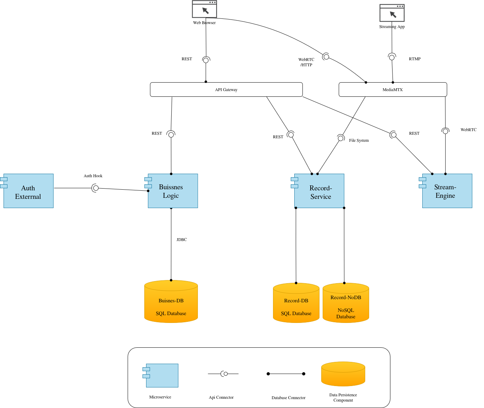

# Blume Platform - README de proyecto 

Plataforma de streaming y aprendizaje compuesta por microservicios. Permite autenticacion de usuarios, transmision en vivo desde OBS, reproduccion WebRTC en navegador y gestion de grabaciones historicas.

## Diagrama C&C (Component and Connector)



## Vision general de arquitectura

- `arquisoft-front`: frontend Next.js (vistas de exploracion, transmision y grabaciones).
- `business-logic`: backend Spring Boot para autenticacion, sesiones y reglas de negocio.
- `stream-engine`: backend Go de control para sesiones de visualizacion y hooks de MediaMTX.
- `mediamtx`: servidor media (ingest RTMP, reproduccion WHEP/WebRTC y generacion de recordings).
- `record-service`: procesamiento de grabaciones; escanea archivos, sube a S3/MinIO y guarda metadatos.
- Persistencia:
  - MySQL principal para `business-logic`.
  - MySQL dedicado para `record-service`.
  - MinIO como almacenamiento de objetos S3-compatible.
- `traefik`: gateway local unico para frontend y APIs (paridad conceptual con despliegue cloud).

## Flujo funcional end-to-end

1. Usuario profesor crea/inicia stream desde el frontend.
2. OBS publica video por RTMP a `mediamtx`.
3. `stream-engine` autoriza publish/read y entrega sesiones de visualizacion.
4. Estudiantes consumen la transmision por WebRTC/WHEP en navegador.
5. Al finalizar, `mediamtx` deja el archivo en volumen compartido (`/recordings`).
6. `record-service` detecta archivo estable, lo sube a MinIO y persiste metadatos en su DB.
7. Frontend consulta `/api/recordings` para mostrar el catalogo historico.

## Estructura del repositorio

```text
1C/
├── infrastructure/   # Compose local, gateway, variables y documentacion de ejecucion
├── arquisoft-front/  # Frontend Next.js
├── business-logic/   # API Spring Boot (auth + negocio)
├── stream-engine/    # API Go (control de streaming + hooks MediaMTX)
└── record-service/   # Servicio Go (procesamiento y catalogo de grabaciones)
```

## Servicios y puertos principales

| Servicio | URL / Puerto | Uso |
|---|---|---|
| Gateway `traefik` | `http://localhost` | Entrada unica (frontend + APIs) |
| Dashboard Traefik | `http://localhost:8088` | Debug de routing |
| Media ingest RTMP | `rtmp://localhost:1935/live` | Publicacion desde OBS |
| Media playback WHEP | `http://localhost:8889` | Reproduccion WebRTC |
| MySQL negocio | `localhost:3306` | Datos de `business-logic` |
| MinIO API | `http://localhost:9000` | Objetos de grabaciones |
| MinIO consola | `http://localhost:9001` | Administracion de bucket |

## Arranque rapido local

Desde `infrastructure/`:

```bash
cp .env.example .env
docker compose up --build
```

Accesos recomendados:

- App: `http://localhost/explorar`
- Grabaciones: `http://localhost/grabaciones`

Apagar y limpiar volumenes:

```bash
docker compose down -v
```

## Endpoints clave (via gateway)

- Auth y negocio: `GET/POST /api/auth/*`, `GET /api/health`
- Streaming:
  - `POST /auth/mediamtx`
  - `GET /api/viewer-session?path=/live/<key>`
  - `GET /api/stats`
- Grabaciones:
  - `GET /api/recordings`
  - `GET /api/recordings/:id`
  - `POST /internal/recordings/reconcile` (operacion interna/manual)

## Variables y secretos importantes

- `infrastructure/.env` define credenciales DB/MinIO y valores de runtime compartidos.
- Requiere credencial Firebase para `business-logic`:
  - archivo: `business-logic/backend-core/firebase/serviceAccountKey.json`
  - se monta como volumen de solo lectura en contenedor.
- En local, `record-service` usa endpoint S3 interno (`minio`) y URL publica local para reproduccion.

## Despliegue cloud (Terraform)

La carpeta de infraestructura contempla despliegue productivo con componentes equivalentes:

- servicios en contenedores (incluyendo `record-service`);
- storage de objetos para grabaciones;
- base de datos dedicada para metadatos de recordings;
- imagenes en registry y ruteo para `/api/recordings/*`.