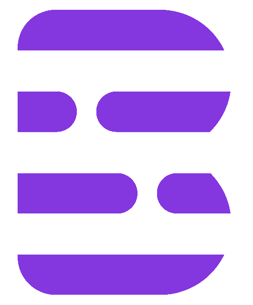
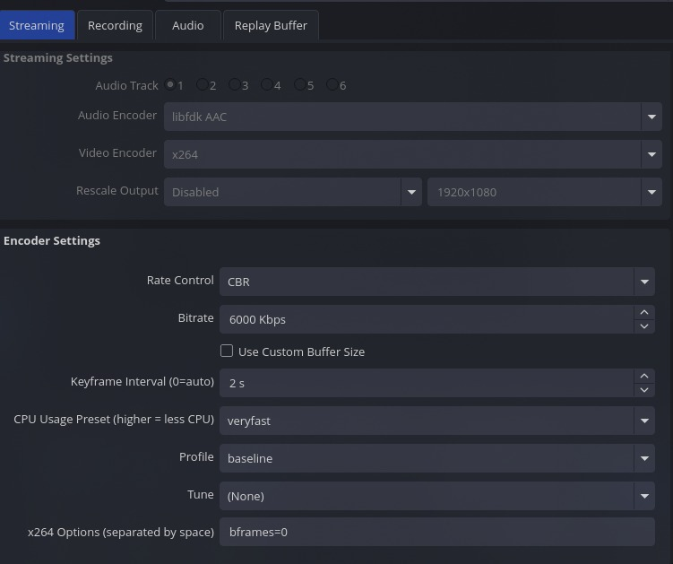

# Blume Platform - Project README

## Team

**Group:** 1C

| Full Name | GitHub Profile |
|---|---|
| Andrés Felipe Alarcón Pulido | [andrefalar](https://github.com/orgs/Salon-1C/people/andrefalar) |
| Juan Jerónimo Gómez Rubiano | [jujgomezru](https://github.com/orgs/Salon-1C/people/jujgomezru) |
| Diego Esteban Ospina Ladino | [DOspinalUN23](https://github.com/orgs/Salon-1C/people/DOspinalUN23) |
| Jared Mijail Ramírez Escalante | [JaredMijailRE](https://github.com/orgs/Salon-1C/people/JaredMijailRE) |
| Felipe Rojas Marín | [Olyveon](https://github.com/orgs/Salon-1C/people/Olyveon) |
| Juan Camilo Rosero Santisteban | [juan-camilo-rosero](https://github.com/orgs/Salon-1C/people/juan-camilo-rosero) |

---

## Software System

**Name**: Blume

**Logo:**



### Description

Streaming and learning platform composed of microservices. It allows user authentication, live streaming from OBS, WebRTC playback in a browser, and management of historical recordings.

## Architectural Structures

### Components and Connectors View

> **Delivery 1 (initial):** The first version of the C&C view modeled only three runtime components — `blume_wa` (web frontend), `blume_business_logic_ms` (Spring Boot), and `blume_stream_ms` (Go stream engine) — connected by REST and HLS over a single API Gateway. Databases and the media server appeared as external elements with no intermediate layers.
>
> **Delivery 2 (current):** The updated view adds the four services incorporated in the second delivery: `blume_stream_activities_ms` (Phoenix/WebSocket for live chat), `blume_record_ms` (Go recording processor), `blume_recomendations_ms` (FastAPI), and `blume_ma` (Flutter mobile client). RabbitMQ is now modeled explicitly as an asynchronous connector between `blume_stream_ms`, `mediamtx`, and `blume_record_ms`. MinIO replaces the generic object-storage reference. The gateway (Traefik) is shown as a concrete component with its routing rules, and Firebase is typed as an external Auth service rather than a plain dependency.


### Deployment View

> Shows the local Docker Compose deployment across two physical nodes. Node 1 hosts all services inside a Docker bridge network (`blume_net`): Traefik (port 80/8088) acts as the sole HTTP entry point and routes by path prefix to each backend container — `blume_business_logic_ms` (Spring Boot, port 8082), `blume_stream_ms` (Go, port 8080), `blume_record_ms` (Go, port 8081), `blume_recommendations_ms` (FastAPI, port 8000), and `blume_stream_activities_ms` (Phoenix, ports 4000). Each service connects internally to its own data store: MySQL 8.4 (port 3306) for business and recording, PostgreSQL 16 (port 5432) for activities, MinIO (port 9000/9001) for object storage, and RabbitMQ 3.13 (port 5672) for async recording events. `blume_wa` (Next.js, port 3000) is also containerized within the same network. Node 2 represents an Android device running the Flutter motor. Firebase operates externally over WWW as the auth provider.


### Layered View

> Organizes the entire Blume platform into three horizontal layers enforcing a strict top-to-bottom dependency direction; no lower layer may depend on an upper one. The **Presentation Layer** contains `blume_wa` and `blume_ma`, both routing requests through `blume_ag` (Traefik) as the single entry point — following a Layered Architecture pattern at the system level. The **Business Layer** hosts all backend microservices: `blume_business_logic_ms` applies Hexagonal Architecture internally, with outer adapters (controllers) depending inward through application → domain → repositories, never the reverse; `blume_recommendations_ms` operates as an independent service; `blume_stream_activities_ms`, `blume_record_ms`, and `blume_stream_ms` each expose their own internal layering. The **Database Layer** at the bottom contains MySQL and MediaMTX, reachable only from the Business Layer.


### Decomposition View

> Illustrates the structural breakdown of the Blume ecosystem using a strict "is-part-of" relationship: each module contains its submodules, and submodules contain their elements — no communication or runtime flow is represented. At the top level the platform divides into seven modules: `webapp`, `mobileapp`, `business_logic_ms`, `stream_ms`, `record_ms`, `stream_activities_ms`, and `infrastructure`. Each decomposes further — notably `business_logic_ms` contains `authentication`, `channels`, and `streams`, each of which in turn contains `domain`, `application`, and `infrastructure` sublayers. Functions are expressed as actions: authenticate user with email/Google, register user, validate stream key, process recording, send and receive messages. The `infrastructure` module contains gateway (Traefik), media server (MediaMTX), messaging (RabbitMQ), external auth (Firebase), and persistence (MySQL, MinIO).


### Description of architectural styles and patterns

## Architectural Styles

**Microservices Architecture**
Blume is built as a microservices architecture. Each service is independently developed, deployed, and scaled. Services own their domain and communicate over HTTP; no shared database or shared runtime exists between them.

*Why microservices and not a monolith or SOA:*
First of all, the system has to be designed to offer independent deployability. Each service has its own `Dockerfile`, its own deployment pipeline, and can be updated or scaled without touching the others. `blume_stream_ms` can be scaled horizontally for peak broadcast load while `blume_business_logic_ms` remains unchanged.

Each domain handles its own individual responsabilities. `blume_business_logic_ms` owns users, channels, classes, and notes. `blume_stream_ms` owns stream sessions, HLS segments, and viewer counts. Neither service reads the other's database.

Each service is written in the language best suited for its workload:
- Java/Spring Boot for transactional business logic
- Go/Gin for high-concurrency streaming and SSE
- TypeScript/Next.js for the frontend. 

This is only practical when services are truly independent.

Additional services (recommendations, notifications, analytics, billing) will be added as independent deployable units without modifying existing ones. The service boundary is the contract, not the codebase.

On the other hand, communication is handled through HTTP-based connectors. Services integrate exclusively through documented HTTP contracts. `blume_stream_ms` exposes internal REST endpoints that `blume_business_logic_ms` calls to resolve live stream metadata. The frontend calls both services directly for their respective domains.

**Distributed System**
The solution spans across two physical nodes (server + mobile client) and multiple containers, coordinating through network protocols to appear as a single coherent system.

## Architectural Patterns

- **API Gateway**: `traefik` acts as the single entry point, routing all HTTP requests to the appropriate backend microservices and handling cross-cutting concerns.
- **Hexagonal Architecture (Ports and Adapters)**: Applied internally within `blume_business_logic_ms` to isolate the core domain from external infrastructure.
- **Layered Architecture**: Applied both at the macro-level (Presentation, Business, Database layers) and at the micro-level within services (e.g. `blume_stream_ms`) to enforce strict dependency rules.
- **Event-Driven Architecture (Async)**: While synchronous communication uses HTTP contracts, asynchronous events are used for processing recordings. `blume_stream_ms` publishes events to `RabbitMQ` when a stream segment is ready, and `blume_record_ms` consumes them asynchronously.

## Fulfillment of Non-Functional Requirements (NFRs)

- **≥ 2 Frontends**: Implemented via `blume_wa` (Next.js web app) and `blume_ma` (Flutter mobile app).
- **≥ 5 Services**: The backend is composed of `blume_business_logic_ms`, `blume_stream_ms`, `blume_record_ms`, `blume_stream_activities_ms`, and `blume_recomendations_ms`.
- **SSR (Server-Side Rendering)**: Implemented in `blume_wa` using Next.js App Router for dynamic pages like class details.
- **Asynchrony (Messaging)**: Achieved via RabbitMQ to decouple the media server's file completion from the recording processing service.
- **≥ 4 Data Sources**: The system utilizes MySQL (relational), PostgreSQL (relational), MinIO (object storage), and MediaMTX (media segments).
- **≥ 5 Languages**: The ecosystem is built using TypeScript (Next.js), Dart (Flutter), Java (Spring Boot), Go (Stream/Record), and Elixir (Phoenix).
- **Dockerized**: 100% of the backend infrastructure and services are containerized and orchestrated via `docker-compose.yml`.

#### Internal architecture

Within `blume_business_logic_ms`, the internal structure follows Hexagonal Architecture, organized via vertical slicing by feature domain. This is a variant of layered architecture where the dependency direction is strictly inward: outer layers (infrastructure, adapters) depend on inner layers (application, domain), never the reverse.

The layers within each vertical slice are:

1. **Domain Layer** — Contains entities, value objects, domain exceptions, and port interfaces (both inbound and outbound). Has zero dependencies on any framework. Defines what the system *is*.
2. **Application Layer** — Contains use case orchestrators (services). Depends only on domain ports (interfaces). Defines what the system does, without knowing how it is delivered or persisted.
3. **Infrastructure Layer** — Contains all adapters: inbound (HTTP controllers, filters) and outbound (JPA repositories, SMTP client, Firebase SDK client, JWT library). Depends on the application and domain layers. Defines how the system connects to the outside world.

This structure applies per feature slice (`authentication/`, `channels/`, `activities/`, etc.), so each feature is a self-contained vertical unit with its own domain, application, and infrastructure sub-packages.

`blume_stream_ms` (Go + Gin) follows a simpler layered structure given its narrower scope: a `config` package, a `server` package (routing and middleware), and `internal` packages per concern (`auth`, `signaling`, `media`), with no external dependencies between them.

### Description of architectural elements and relationships

#### Architectural elements

| Component | Technology | Role |
|---|---|---|
| `blume_wa` | Next.js 16, TypeScript, React 19 | Rich web client. Serves all user-facing pages, manages session state via React Context, and consumes both backend services over HTTP. |
| `blume_business_logic_ms` | Spring Boot 3.3.5, Java 21 | Central backend. Handles user authentication (local and Google/Firebase), session management via signed JWT cookies, password reset via SMTP, and all core business domain logic. |
| `blume_stream_ms` | Go 1.22+ | Streaming orchestration server. Validates RTMP stream keys for MediaMTX, generates WHEP URLs for WebRTC-based playback, and tracks live viewer counts. |
| `blume_record_ms` | Go Service |Recording processing; scans files, uploads to S3/MinIO, and saves metadata.|
| `MySQL 8.4` | Relational Database | Primary data store. Holds users, roles, auth providers, password reset tokens, channels, streams, chat messages, viewer sessions, and analytics events. Managed via Flyway migrations (6 versioned scripts). |
| `MediaMTX` | bluenviron/mediamtx (Docker) | Media server (RTMP ingest, WHEP/WebRTC playback, and recording generation). |
| `Cloudflare R2` | Object Storage + CDN | Hosts the HLS media segments produced by MediaMTX and delivers them to browsers with CDN caching. |
| Minio|MinIO console | S3-compatible object storage.|
| `Firebase` | Google Identity Platform | Provides Google OAuth. The frontend uses the Firebase JS SDK to obtain an ID token; `blume_business_logic_ms` verifies it using the Firebase Admin SDK (service account). |
| `traefik` |Traefik (Docker)| Single local gateway for the frontend and APIs (conceptual parity with cloud deployment).|
| `blume_ma` | Flutter (Dart) | Native mobile client (Android / iOS). Consumes the same REST API as the web frontend via Dio + persistent cookie session. Includes a demo mode that works without a running backend. |


#### End-to-end functional flow

1. The instructor creates/starts the stream from the frontend.

2. OBS publishes the video via RTMP to `mediamtx`.

3. `blume_stream_ms` authorizes publish/read access and delivers viewing sessions.

4. Students access the stream via WebRTC/WHEP in their browsers.

5. Upon completion of each segment, `mediamtx` captures the fragment and emits it as a queued event payload.

6. `mediamtx` notifies `blume_stream_ms` when a record segment is closed.

7. `blume_stream_ms` publishes that event into RabbitMQ (`recordings.ready`).

8. `blume_record_ms` consumes each queued fragment asynchronously, uploads to MinIO, and persists metadata.

9. The frontend queries `/api/recordings` to display the historical catalog.

### General structure

```text
1C/
├── infrastructure/               # Compose local, gateway, variables and execution documentation
├── blume_wa/                     # Next.js Frontend
├── blume_business_logic_ms/      # API Spring Boot (auth + business)
├── blume_stream_ms/              # API Go (streaming control + MediaMTX hooks)
├── blume_record_ms/              # Go service (recordings process and catalog)
└── blume_ma/                     # Flutter mobile app (Android / iOS)
```

### Clone all repositories in one parent folder

To run everything with a single `docker compose up`, clone all repositories under the same parent directory:

```bash
mkdir -p 1C && cd 1C
git clone https://github.com/Salon-1C/infrastructure.git
git clone https://github.com/Salon-1C/blume_wa.git
git clone https://github.com/Salon-1C/blume_business_logic_ms.git
git clone https://github.com/Salon-1C/blume_stream_ms.git
git clone https://github.com/Salon-1C/blume_record_ms.git
git clone https://github.com/Salon-1C/blume_ma.git
git clone https://github.com/Salon-1C/blume_recomendations_ms.git
git clone https://github.com/Salon-1C/blume_stream_activities_ms.git

```

Expected folder layout:

```text
1C/
├── infrastructure/
├── blume_wa/
├── blume_business_logic_ms/
├── blume_stream_ms/
├── blume_record_ms/
└── blume_ma/
```

### Main services and ports

| Service | URL / Port | Use |
|---|---|---|
| Gateway `traefik` | `http://localhost` | Unique entrypoint (frontend + APIs) |
| Dashboard Traefik | `http://localhost:8088` | Routing debugging |
| Media ingest RTMP | `rtmp://localhost:1935/live` | OBS publishing |
| Media playback WHEP | `http://localhost:8889` | WebRTC reproduction|
| MySQL business | `localhost:3306` | `blume_business_logic_ms` data |
| MinIO API | `http://localhost:9000` | Recording objects |
| MinIO console | `http://localhost:9001` | Bucket management |
| RabbitMQ AMQP | `amqp://localhost:5672` | Queue for async recording processing |
| RabbitMQ UI | `http://localhost:15672` | Queue monitoring (`guest/guest`) |

## Prototype (Instructions to run project)

### Prerequisites

| Tool | Version | Purpose |
|---|---|---|
| Docker + Docker Compose | Latest stable | MySQL, MediaMTX |

From `infrastructure/`:

```bash
cp .env.example .env
docker compose up --build
```

Recommended endpoints:

- App: `http://localhost/explorar`
- Recordings: `http://localhost/grabaciones`

### OBS configuration (recommended)

Use these settings in OBS to publish stable streams to `mediamtx`:

- **Service**: Custom
- **Server**: `rtmp://localhost:1935/live`
- **Stream key**: your stream key (for example: `abc123`)
- **Audio encoder**: AAC
- **Video encoder**: x264
- **Rate control**: CBR
- **Bitrate**: `6000 Kbps`
- **Keyframe interval**: `2s`
- **CPU usage preset**: `veryfast`
- **Profile**: `baseline`

Reference screenshot:



Shut down and clean volumes:

```bash
docker compose down -v
```

### Key endpoints

- Auth and business: `GET/POST /api/auth/*`, `GET /api/health`
- Streaming:
  - `POST /auth/mediamtx`
  - `GET /api/viewer-session?path=/live/<key>`
  - `GET /api/stats`
- Recordings:
  - `GET /api/recordings`
  - `GET /api/recordings/:id`
  - `POST /internal/recordings/reconcile` (manual/internal operation)

### Variables and secrets

- `infrastructure/.env` defines shared DB/MinIO credentials and runtime values.

- Requires Firebase credentials for `blume_business_logic_ms`:

- file: `blume_business_logic_ms/firebase/serviceAccountKey.json`

- Mounted as a read-only volume in a container.

- On-premises, `blume_record_ms` uses an internal S3 endpoint (`minio`) and a local public URL for playback.

### Cloud deployment

The infrastructure folder includes a production deployment with equivalent components:

- containerized services (including `blume_record_ms`);

- object storage for recordings;

- dedicated database for recording metadata;

- registry images and routing for `/api/recordings/*`.


# Decomposition Structure

## Decomposition View Description

The BLUME system is decomposed into a hierarchy of modules using a strict **“is part of”** relationship. This view describes the structural organization of the system, without representing control flow, communication, or runtime behavior.

---

## System Decomposition

The **BLUME** system is decomposed into seven main modules:

- blume_wa  
- blume_ma  
- blume_business_logic_ms  
- blume_stream_ms  
- blume_record_ms  
- blume_stream_activities_ms  
- blume_infrastructure  

Each of these modules **is part of** the BLUME system.

---

## blume_wa (Web Application)

The **blume_wa** module is decomposed into the following submodules:

- auth  
- marketing  
- app  
- player  
- shared  

Each submodule **is part of** blume_wa.

- **auth** includes: login with email, login with Google, user registration, onboarding, password recovery  
- **marketing** includes: public landing page  
- **app** includes: enrolled channels listing, channel detail, public streams exploration, recordings catalog  
- **player** includes: live stream playback, recording playback, live chat  
- **shared** includes: session management and centralized API layer  

---

## blume_ma (Mobile Application)

The **blume_ma** module is decomposed into:

- auth  
- app  
- player  
- shared  

Each submodule **is part of** blume_ma.

- **auth** includes: login, registration, onboarding, password recovery  
- **app** includes: channel navigation and content exploration  
- **player** includes: stream playback and live chat  
- **shared** includes: persistent session management, demo mode, API layer  

---

## blume_business_logic_ms (Main Backend)

The **blume_business_logic_ms** module is decomposed into:

- authentication  
- channels  
- streams  
- shared  
- health  
- database  

Each submodule **is part of** blume_business_logic_ms.

### Internal Layering (for authentication, channels, streams)

Each of the modules **authentication**, **channels**, and **streams** is further decomposed into:

- domain  
- application  
- infrastructure  

Each layer **is part of** its corresponding module.

---

### authentication

The **authentication** module includes:

- **domain**: user, role, authentication provider, password reset token, password policies, domain contracts  
- **application**: user registration, authentication (local and Google), session validation, password reset, onboarding  
- **infrastructure**: HTTP controllers, persistence adapters, JWT handling, Firebase integration, password hashing, email notifications, cookie-based session handling  

---

### channels

The **channels** module includes:

- **domain**: channel entities and access rules  
- **application**: enrolled channels retrieval, channel detail retrieval  
- **infrastructure**: REST controllers and persistence  

---

### streams

The **streams** module includes:

- **domain**: class entities, stream status, visibility and access rules  
- **application**: class listing, filtering and detail retrieval  
- **infrastructure**: REST controllers and persistence  

---

### shared

The **shared** module includes:

- security configuration, JWT filters, global exception handling, shared DTOs  

---

### health

The **health** module includes:

- system health check endpoint  

---

### database

The **database** module includes:

- database migrations and schema versioning  

---

## blume_stream_ms (Streaming Engine)

The **blume_stream_ms** module is decomposed into:

- auth  
- signaling  
- media  
- stats  
- config  

Each submodule **is part of** blume_stream_ms.

- **auth** includes: stream authorization and stream key validation  
- **signaling** includes: viewer session generation  
- **media** includes: recording event handling  
- **stats** includes: connected viewers metrics  
- **config** includes: service configuration  

---

## blume_record_ms (Recording Service)

The **blume_record_ms** module is decomposed into:

- consumer  
- processing  
- catalog  

Each submodule **is part of** blume_record_ms.

- **consumer** includes: event consumption from messaging system  
- **processing** includes: recording processing and storage  
- **catalog** includes: metadata persistence and API exposure  

---

## blume_stream_activities_ms (Stream Activities)

The **blume_stream_activities_ms** module is decomposed into:

- chat  
- auth  
- database  

Each submodule **is part of** blume_stream_activities_ms.

- **chat** includes: message sending, receiving, and history  
- **auth** includes: user validation  
- **database** includes: chat persistence schema  

---

## blume_infrastructure (Infrastructure)

The **blume_infrastructure** module is decomposed into:

- gateway  
- media_server  
- messaging  
- auth_external  
- persistence  
- deployment  

Each submodule **is part of** blume_infrastructure.

- **gateway** includes: request routing  
- **media_server** includes: video ingestion and playback  
- **messaging** includes: asynchronous processing queues  
- **auth_external** includes: external authentication provider  
- **persistence** includes: relational databases and object storage  
- **deployment** includes: container orchestration and environment configuration  

---

## Repositories

[blume_business_logic_ms](https://github.com/Salon-1C/blume_business_logic_ms)

[infrastructure](https://github.com/Salon-1C/infrastructure)

[blume_stream_ms](https://github.com/Salon-1C/blume_stream_ms)

[blume_wa](https://github.com/Salon-1C/blume_wa)

[blume_ma](https://github.com/Salon-1C/blume_ma)
